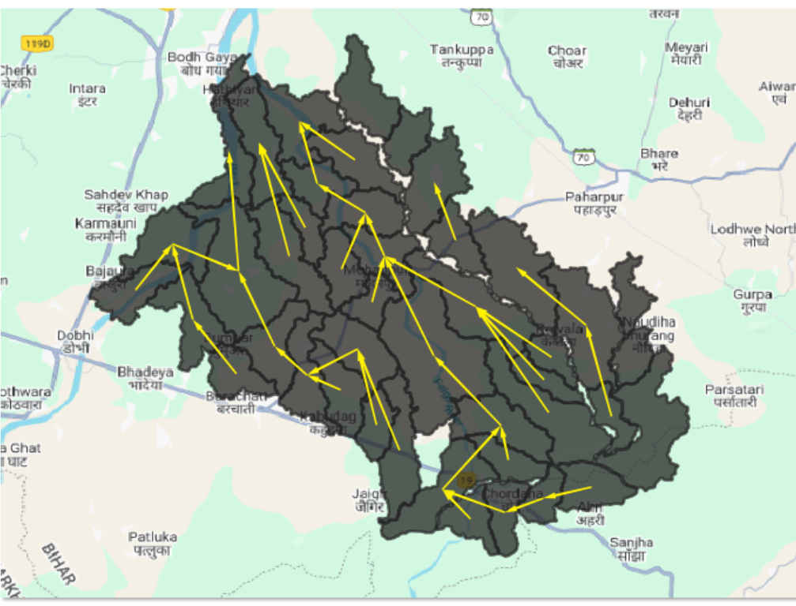

# MWS Connectivity

## Introduction  
Identifying upstream and downstream microwatersheds in a basin is useful for planning water structures in an equitable manner. Upstream microwatersheds contribute water to downstream areas, affecting surface runoff and groundwater recharge. If upstream areas are harvesting more surface runoff or over-extracting groundwater, downstream farmers may face water shortages.  
Conservation efforts like check dams and afforestation are usually performed in upstream areas to enhance downstream water availability.  

## Methodology  
A micro-watershed has a single pour point as its outlet connecting to a downstream micro-watershed but can receive inflow from multiple upstream micro-watersheds. We identified the pour point of each micro-watershed using flow accumulation. Each pour point was mapped to its downstream micro-watershed to which it flows, resulting in a micro-watershed connectivity network in a basin.  

The figure below shows an instance of a micro-watershed connectivity network.  

## Hosting Specifications  
- **Layer type:** vector  
- **Spatial resolution:** NA  
- **Temporal resolution:** static  
- **Dataset:** [Google drive folder]()  

## Figure  
  

**Figure:** Upstream-downstream connectivity of micro-watersheds across Mohanpur block in Gaya district of Bihar.  

