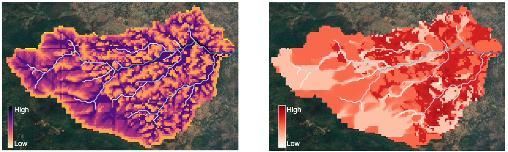

# Accumulation of Runoff Dataset

- TODO : need to first review the runoff script and then finalise it

## Figure  
  

**Figure:** The figure on the left shows average runoff accumulated in non-drought years, and the figure on the right shows the sensitivity of runoff accumulation during drought years expressed as percentage deviation.  
