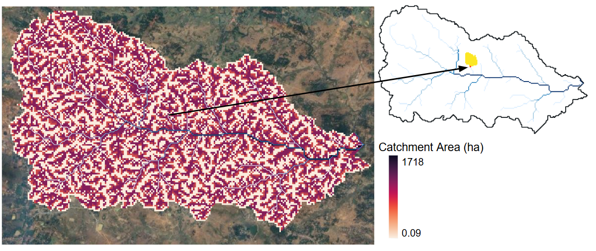

# Catchment Area Raster 

<!-- ## Introduction -->

## Input Layers
1. **Digital Elevation Model (DEM):**  
   - A DEM serves as the base input for hydrological analysis. It provides elevation data that helps delineate catchments and flow accumulation patterns.  
   - A depression-less DEM is derived by filling sinks to ensure continuous flow paths.  

## Methodology
The catchment area raster is computed using the `GRASS GIS r.watershed` module, which calculates flow accumulation based on the input depressionless DEM.  

The **accumulation raster** is generated as an intermediate output, representing the number of upstream pixels contributing to each pixel in the raster. To convert the accumulation values into hectares, each pixel value is multiplied by **0.09**, considering a spatial resolution of **30m × 30m**. The resulting raster represents the contributing catchment area in hectares for each pixel.  

The final output is saved as a **GeoTIFF** file with appropriate spatial reference and geo-transformation settings to maintain geo-spatial accuracy.  

## Hosting Specifications
- **Layer type:** raster  
- **Spatial resolution:** 30 m  
- **Temporal resolution:** static  
- **Dataset:** [Google drive folder]()  

## Figure  
  

**Figure:** The left figure shows the computed catchment area of each pixel of a micro-watershed in the Masalia block in Dumka district of Jharkhand. The right figure shows the delineated catchment area (highlighted in yellow) of a drainage pixel (highlighted in red).  

