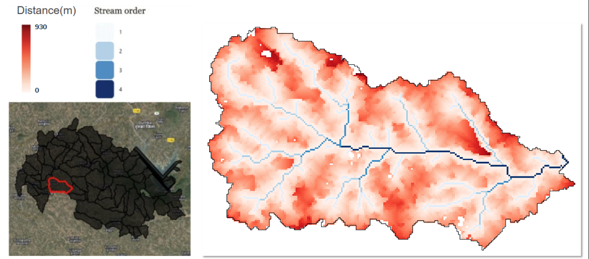

# Distance to Upstream Drainage Line

## Input Layers
The computation of distance to the upstream drainage line raster requires the following input layers:

1. **Digital Elevation Model (DEM):**  
   - A DEM serves as the base input for hydrological analysis. It provides elevation data that is used to find the upstream drainage line.  
   - A depression-less DEM is derived by filling sinks to ensure continuous flow paths.  

2. **Drainage Line:**  
   - This raster layer contains the drainage lines within the study area, where the pixel value represents the stream order of drainage line.

## Methodology
The computation of the distance to the nearest upstream drainage line begins by identifying drainage pixels within the input raster. A binary mask is created to differentiate drainage pixels from non-drainage pixels, where all pixels with a drainage line value greater than zero are classified as drainage pixels.  

To efficiently determine the nearest drainage line for each non-drainage pixel, a k-d tree is constructed using the coordinates of all drainage pixels. This spatial index allows for rapid nearest-neighbor searches, significantly reducing computational complexity. A drainage pixel is classified as a valid upstream candidate if its elevation is greater than or equal to the elevation of the non-drainage pixel in question. If such valid upstream drainage pixels exist, a new k-d tree is constructed using only these pixels, and a nearest-neighbor search is performed to determine the closest upstream drainage pixel. The computed Euclidean distance between the non-drainage pixel and the nearest upstream drainage pixel is then stored in a matrix representing the minimum distances for all non-drainage pixels.  

Once all distances are computed, the results undergo post-processing to ensure correctness. The computed distances are rounded to the nearest integer to maintain consistency, and any negative distance values (if encountered due to processing artifacts) are set to -1 to indicate invalid calculations. Finally, the processed distance matrix is saved as a GeoTIFF raster file, ensuring that the spatial reference and transformation of the original dataset are preserved. This methodology ensures an efficient and accurate determination of distances to the nearest upstream drainage line while leveraging spatial indexing techniques for optimized performance.  

## Hosting Specifications
- **Layer type:** raster  
- **Spatial resolution:** 30 m  
- **Temporal resolution:** static  
- **Dataset:** [Google drive folder]()  

## Figure  
  
**Figure:**  The figure shows the distance to the nearest upstream drainage line, computed at each pixel and overlaid with drainage lines of a micro-watershed (highlighted in red) in the Masalia block in Dumka district of Jharkhand.
