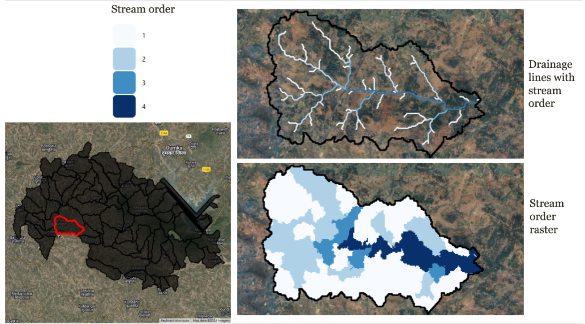

# Stream Order Raster

## Input layers
The computation of stream order rasters requires the following input layers:

1. **Digital Elevation Model (DEM):**  
   - A DEM serves as the base input for hydrological analysis. It provides elevation data that helps delineate catchments and flow accumulation patterns.  
   - A depression-less DEM is derived by filling sinks to ensure continuous flow paths.  

2. **Drainage Line Vector:**  
   - This vector layer contains the geometry of drainage lines within the study area. It is used to identify stream networks and assign stream orders.  

## Methodology
The methodology for computing stream order rasters is outlined below:

1. **Preprocessing:**  
   - The DEM is processed to remove depressions, creating a depression-less DEM. This ensures accurate flow direction and accumulation calculations.  
   - The drainage line vector layer is converted to a raster format to overlay with the catchment raster.  

2. **Catchment Delineation:**  
   - Using the GRASS GIS module `r.watershed()`, the depression-less DEM is analyzed to delineate sub-basins or catchments.  
   - A flow accumulation threshold of 100 pixels is applied to define catchments, with each catchment assigned a unique ID.  

3. **Overlay Analysis:**  
   - The rasterized drainage lines are overlaid with the catchment raster.  
   - Each catchment ID is assigned the maximum stream order value of the drainage line lying inside the catchment.  

4. **Output Generation:**  
   - The final output is a stream order raster where each pixel represents the highest stream order within its catchment.  
   - This dataset has been computed at the sub-basin level for all of India and made available as:  
     1. A Google Earth Engine (GEE) asset for easy integration into geospatial workflows.  
     2. Raster images stored in Google Drive for offline use.  

## Hosting specifications
- **Layer type:** raster  
- **Spatial resolution:** 30 m  
- **Temporal resolution:** static  
- **Dataset:**  
  - [EE Asset](https://code.earthengine.google.com/?asset=projects/ee-ankit-mcs/assets/Stream_Order_Raster_India)  
  - [Google Drive](https://drive.google.com/file/d/11O3JFBWHP-uOr97J_zNPzL2Fd4AsvdDl/view?usp=sharing)  

## Figure

**Figure 1:** The figure shows drainage lines and the stream order raster map of a micro-watershed (highlighted in red) in the Masalia block in Dumka district of Jharkhand.  

