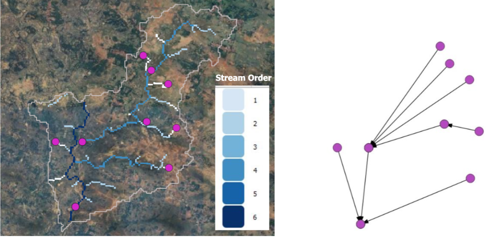

## Introduction  
Establishing upstream-downstream connectivity between waterbodies is crucial to understanding hydrological interactions and planning effective water resource management. The waterbodies within a basin are interconnected through drainage lines, influencing the flow of surface water and storage dynamics. Identifying these connections helps assess water availability, design conservation structures, and ensure equitable water distribution.  

This methodology focuses on building a **waterbody connectivity graph** by linking upstream and downstream waterbodies according to drainage flow. It integrates the locations of the waterbodies with the generated drainage network, ensuring that even isolated waterbodies are properly connected through a constructed flow path.  

## Input Layers  
The computation of waterbody connectivity requires the following input layers:  

1. **Waterbody Vector:**  
   - A vector dataset that contains the spatial extent and geometry of waterbodies within the study area.  
   - Used to determine connectivity between upstream and downstream waterbodies.  

2. **Drainage Line Raster:**  
   - A raster dataset representing the drainage network, which facilitates flow routing and connectivity analysis.  
   - Used to map the flow paths of waterbodies that do not directly intersect the drainage network.  

3. **Digital Elevation Model (DEM):**  
   - Provides elevation information to determine the flow direction and identify the downslope path for non-intersecting waterbodies.  

## Methodology  

### **1. Identifying Waterbody-Drainage Line Intersections**  
Waterbodies are first classified into two categories based on their intersection with drainage lines:  
- **Intersecting Waterbodies:** Waterbodies that already overlap with drainage lines, making their connectivity straightforward.  
- **Non-Intersecting Waterbodies:** Waterbodies that do not overlap with drainage lines and require additional processing to determine their connectivity.  

### **2. Constructing Drainage Paths for Non-Intersecting Waterbodies**  
For each non-intersecting waterbody, the centroid is computed, and the elevation raster is used to determine the downslope direction. The process iteratively traces the downslope path until it intersects with a drainage line. This newly constructed path is then integrated into the existing drainage network, ensuring that all waterbodies are connected to the hydrological system.  

### **3. Establishing Waterbody Connectivity Graph**  
Once all waterbodies are connected to the drainage network, a **waterbody connectivity graph** is created:  
- For each waterbody, the **downstream** waterbody within its **1-neighborhood** is identified.  
- A directed edge is added from the upstream waterbody to the downstream waterbody, forming a structured connectivity graph.  

The resulting waterbody connectivity graph provides insights into hydrological interactions between waterbodies, supporting effective water resource planning and management.  

## Hosting Specifications  
- **Layer type:** vector  
- **Spatial resolution:** NA  
- **Temporal resolution:** yearly  
- **Codebase:** [GitHub repository](https://github.com/ankit-cse4/MTP-ICTD/tree/main/Hydrological_Datasets/Site%20level/Waterbody%20connectivity)  

## Figure  
  

**Figure:** The figure on the left shows drainage lines (in shades of blue) with stream order. Using the stream order hierarchy and spatial arrangements of waterbodies (in purple circles shown on top of these drainage lines), a waterbody graph is generated (using directional edges in black) to identify upstream-downstream waterbodies, as shown in the figure on the right.  
